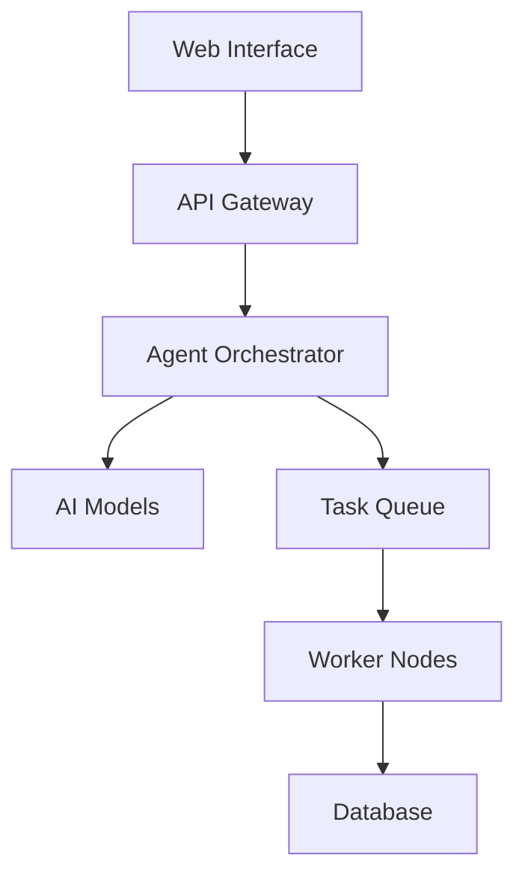

# Allinix Labs

> Pioneering Enterprise-Grade Autonomous AI Agents

## Vision

Allinix Labs is revolutionizing enterprise AI by building the definitive infrastructure layer for autonomous agents. Our platform enables organizations to:
- Deploy AI agents at scale with enterprise-grade security and reliability
- Automate complex business processes through intelligent orchestration
- Maintain full visibility and control over AI operations
- Ensure compliance and governance across AI deployments

## 🚀 Allinix Platform

Enterprise-grade autonomous AI agent platform with advanced orchestration capabilities.

### Core Features

- **Agent Studio**: Create custom AI agents through an intuitive interface
- **Enterprise Control Center**: Centralized management and monitoring
- **Secure Agent Communication**: End-to-end encrypted agent interactions
- **Compliance Framework**: SOC 2, GDPR, and HIPAA compliant
- **Advanced Analytics**: Real-time performance metrics and optimization

### Technical Architecture

## 🛡️ Enterprise Solutions

- **Custom Development**: Tailored AI agents for specific business needs
- **Integration Services**: Seamless connection with existing systems
- **Security Compliance**: Enterprise-grade security protocols
- **24/7 Support**: Dedicated technical assistance

## 📊 Platform Metrics

- **Reliability**: 99.99% uptime SLA
- **Scale**: Processing 10M+ tasks daily
- **Security**: SOC 2 Type II certified
- **Support**: 15-minute response time

## 📚 Resources

- [Documentation](https://allinix-ai.gitbook.io/allinix)
- [Case Studies](https://allinix-ai.gitbook.io/allinix/essentials/allinix-use-cases)
- [Contributing](https://allinix-ai.gitbook.io/allinix/essentials/contributing-to-allinix)
---

<i>Empowering Enterprises with Autonomous AI</i> 
<a href="https://allinix.ai/">https://allinix.ai/</a>

